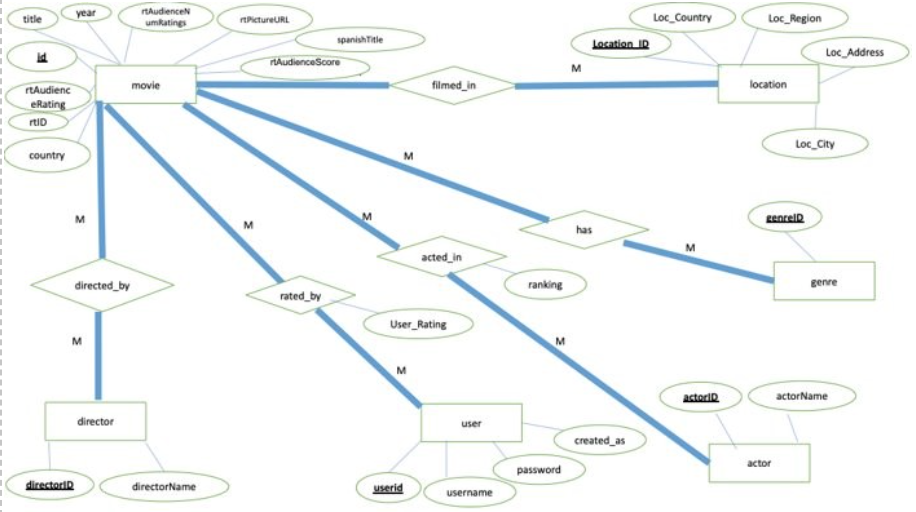

# Sample Walkthrough of Application

# Implementation
The web application we developed firstly opens up to a login page. In order to use the application, the user must either login with a username and password or create an account. The user can be either a general user or an admin user as explained in the introduction portion of this report above. Once logged in, a user is brought to the homepage which showcases the 21 best rated movies from the database. Clicking on a movie image navigates the user to a details page of the movie which includes basic information about the movie, along with the top three actors and list of genres. From here, the user is able to add a rating for the movie out of 100. Back on the homepage, the user has five different options to search for a movie: either by title, year, genre, actor, or country.  

# ER Diagram

# Relational model  

movie(id, rtID, title, year, country, rtAudienceRating, rtAudienceScore, rtPictureURL, spanishTitle, rtAudienceNumRatings) 
    Keys: country 
    Primary Key: id  

director(directorID, directorName) 
    Primary Key: directorID 

location(Location_ID, Loc_Country, Loc_Region, Loc_Address, Loc_City) 
    Keys: movieID 
    Primary Key: Location_ID 

actor(actorID, actorName) 
    Primary Key: actorID 

user(userid, username, password, created_as)  
    Primary Key: userid 

directed_by(movieID, directorID) 
    Primary Key: movieID and directorID 

rated_by(movieID, userID, userRating) 
    Primary Key: movieID and userID 

acted_in(movieID, actorID, ranking) 
    Primary Key: movieID and actorID 

has_genre(movieID, genreID) 
    Primary Key: movieID, genreID 

# Sample Queries
SELECT * FROM movies WHERE movies.title LIKE '%$title%' 

SELECT movies.title, movies.year, movies.rtPictureURL FROM movies WHERE movies.rtAudienceNumRatings > 5000 ORDER BY movies.rtAudienceScore DESC LIMIT 21; 

"SELECT movies.id, movies.title, movies.year, movies.rtPictureURL FROM movies, has_genre WHERE movies.id = has_genre.movieID AND has_genre.genreID LIKE '%$genre%' LIMIT 21"; 

SELECT actor.actorName , Movie.title, Movie.year, Movie.rtPictureURL FROM Movie, actor, acted_in WHERE actor.actorID = acted_in.actorID AND Movie.id = acted_in.movieID AND actor.actorName LIKE '%$actor%'; 

SELECT GROUP_CONCAT(a.actorName order by i.ranking SEPARATOR ', ') FROM acted_in i INNER JOIN actors a ON i.actorID = a.actorID WHERE i.movieID = $id and i.ranking < 4; 

UPDATE movies SET rtAudienceNumRatings = rtAudienceNumRatings+1, rtAudienceScore =  ROUND((((rtAudienceNumRatings*rtAudienceScore) + $score)/rtAudienceNumRatings+1), 0) WHERE id = $id; 

# Stored Procedures
Select movies that premiered in a specific country 
    DELIMITER // CREATE PROCEDURE getMovieByCountry(IN Country VARCHAR(255)) BEGIN SELECT movies.id, movies.title, movies.year, movies.rtPictureURL FROM movies WHERE movies.country LIKE Country LIMIT 21;  
    END // DELIMETER; 

Select movies from a specific year 
    DELIMITER //  
    CREATE PROCEDURE getMovieByYear( IN Year INT(4) ) BEGIN SELECT * FROM movies WHERE movies.year = Year LIMIT 21; END 
    END // DELIMITER ; 

Select more details about a specific movie 
    DELIMITER //  
    CREATE PROCEDURE getMovieDetails( IN mID VARCHAR(5) ) SELECT M.title, M.year, M.rtPictureURL, M.rtAudienceScore, M.country, M.spanishTitle, D.directorName, G.genreID FROM movies M INNER JOIN has_genre G ON M.id = G.movieID INNER JOIN directed_by B ON G.movieID = B.movieID INNER JOIN directors D ON B.directorID = D.directorID WHERE M.id = mID; 
    END // DELIMITER ; 

Add a movie to the database 
    DELIMITER // CREATE PROCEDURE `addMovie`(IN `title` VARCHAR(255), IN `spanishTitle` VARCHAR(255), IN `year` INT(4), IN `rtID` VARCHAR(255), IN `audience_rating` DECIMAL(3), IN `ratings_count` INT(10), IN `audience_score` INT(3), IN `url` VARCHAR(255), IN `country` VARCHAR(50), OUT `ID` INT(10)) BEGIN INSERT INTO movies (movies.title, movies.spanishTitle, movies.year, movies.rtID, movies.rtAudienceRating, movies.rtAudienceNumRatings, movies.rtAudienceScore, movies.rtPictureURL, movies.country) VALUES(title, spanishTitle, year, rtID, audience_rating, ratings_count, audience_score, url, country); SELECT movies.id INTO ID FROM movies WHERE movies.id=( SELECT max(movies.id) FROM movies ); END // DELMITER; 

# Dataset
The dataset we decided to utilize for this project is from MovieLens at the following URL: https://grouplens.org/datasets/hetrec-2011/. It includes information about movies such as genre, country of origin, director, actors, location assignments, as well as links the movies’ Rotten Tomatoes reviews. 

We realized that we did not need the Rotten Tomatoes Entity because the rtID we had initially thought as the primary key was not unique. Multiple movies in a series for some reason had the same ID, like Toy Story. We then decided to just keep some of the relevant fields, such as rtPictureURL, rtAudienceScore, etc. and add them into our movie entity. We also changed some of the names of the entities and attributes to be more consistent with our naming scheme. Another change was the location attribute and its fields. Originally, we thought about just using the filming location as an attribute, but taking closer look at the data, we realized that the filming location could be split up by country, region, city, and address. This realization caused us to add a couple more fields to our location entity, such as Loc_Country, Loc_Region, etc. We also changed our user entity and genre entity as the implementation became clearer. We added a ranking attribute to our acted_in relationship, and then finally we had to modify our genre entity.  